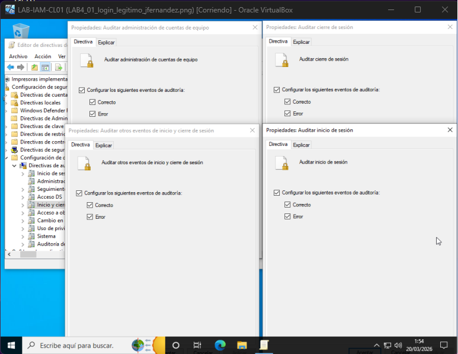
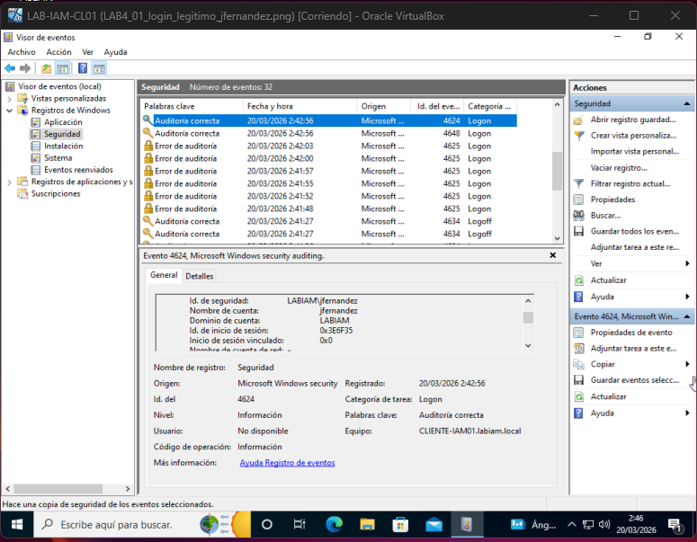
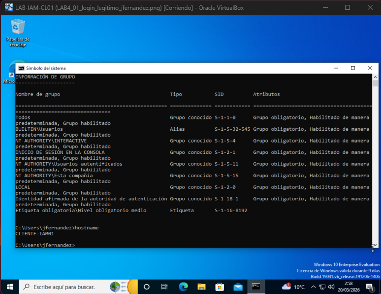
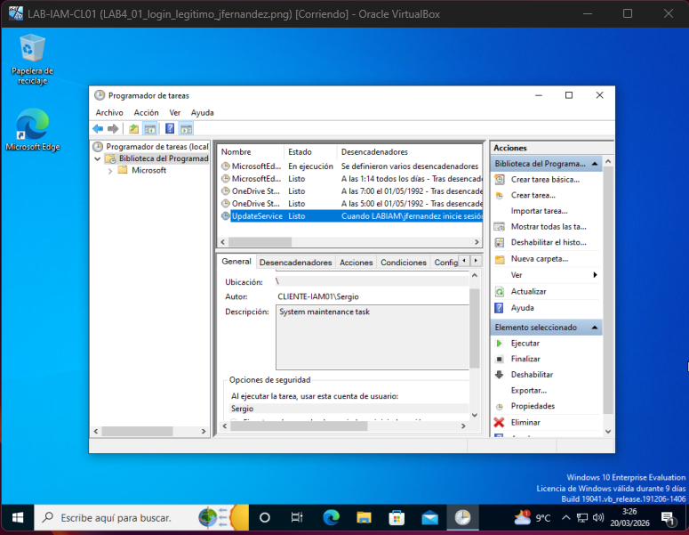
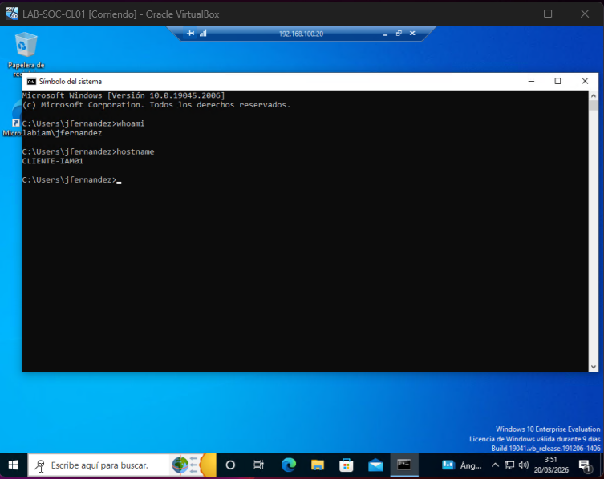
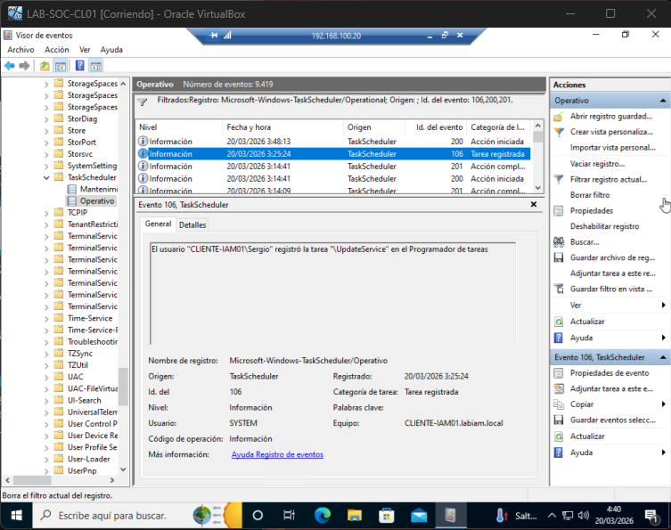
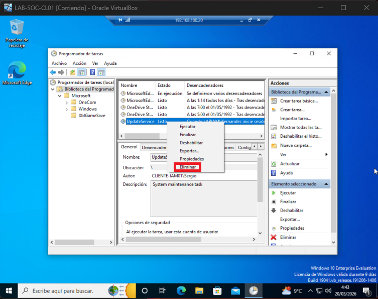
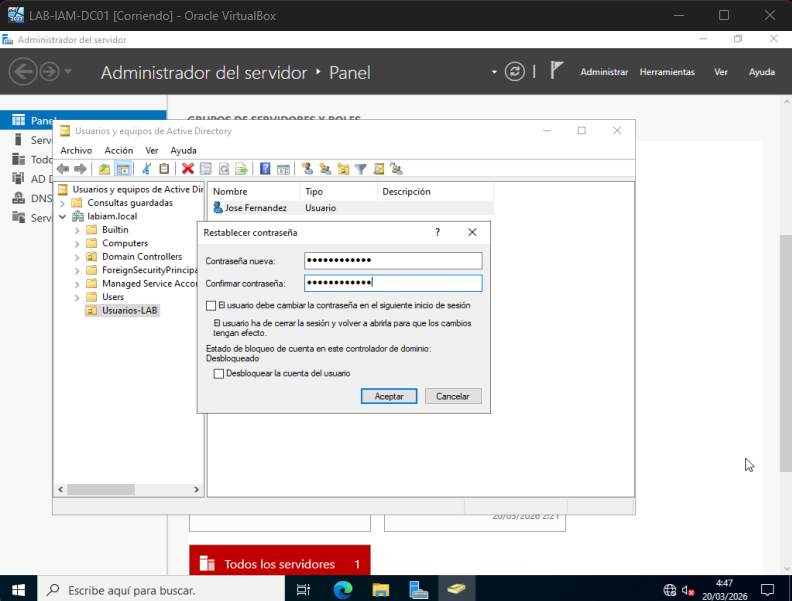

 README — LAB SOC (Detección, Persistencia y Respuesta)

## 1. Introducción

Este laboratorio simula un escenario básico de compromiso en un endpoint Windows dentro de un entorno de dominio.

El objetivo es representar el flujo completo desde el acceso no autorizado hasta la detección, análisis y respuesta por parte de un equipo SOC, utilizando únicamente herramientas nativas del sistema.

---

## 2. Entorno

El laboratorio se ha realizado en un entorno virtualizado con las siguientes máquinas:

LAB-IAM-DC01 → Controlador de dominio  
LAB-IAM-CL01 → Endpoint unido a dominio (equipo comprometido)  
LAB-SOC-CL01 → Equipo SOC (análisis e investigación)  

Todos los sistemas están conectados mediante red interna.

---

## 3. Escenario

Se simula un acceso no autorizado a un endpoint corporativo mediante múltiples intentos fallidos de autenticación seguidos de un acceso exitoso.

Tras el acceso, el atacante realiza acciones básicas de reconocimiento y establece persistencia en el sistema mediante una tarea programada.

El equipo SOC detecta actividad sospechosa e inicia un proceso de investigación y contención.

---

## 4. Preparación del entorno

Se habilita la auditoría de eventos de inicio de sesión mediante políticas locales para asegurar la generación de eventos relevantes (4625 y 4624).

Se verifica la conectividad entre sistemas y el correcto funcionamiento del entorno.

---

## 5. Ejecución del ataque

Se generan múltiples intentos fallidos de autenticación sobre el usuario de dominio, seguidos de un acceso exitoso.

Esta secuencia es clave para identificar un posible compromiso de credenciales:

Una vez dentro del sistema, se realizan acciones básicas de enumeración:

Identificación del usuario (whoami)  
Enumeración de usuarios y grupos  
Identificación del hostname  

Posteriormente, se establece persistencia mediante la creación de una tarea programada.

Debido a limitaciones de permisos del usuario comprometido, la persistencia se crea con privilegios administrativos, lo que indica la necesidad de privilegios elevados para mantener el acceso en el sistema.

---

## 6. Análisis por parte del SOC

El equipo SOC accede remotamente al endpoint comprometido mediante Escritorio Remoto.

Durante el análisis:

Se revisan los eventos de seguridad:

Múltiples 4625 (intentos fallidos)  
4624 (acceso exitoso)  

Esto confirma un posible compromiso de credenciales.

Posteriormente, se analiza el registro de tareas programadas (TaskScheduler/Operational), filtrando eventos:

106 → creación de tarea  
200 / 201 → ejecución  

Se identifica una tarea sospechosa (UpdateService) asociada a persistencia en el sistema.

---

## 7. Contención

Una vez confirmada la persistencia:

Se elimina la tarea programada maliciosa:

Se restablece la contraseña del usuario comprometido desde Active Directory:

No se fuerza el cambio de contraseña en el siguiente inicio de sesión para evitar que un posible atacante con acceso activo pueda modificar las credenciales y mantener el control de la cuenta.

Como medidas adicionales, se considera:

Evaluación del aislamiento del endpoint  
Escalado del incidente a niveles superiores  

---

## 8. Conclusiones

Este laboratorio demuestra cómo un ataque básico puede evolucionar desde intentos de autenticación fallidos hasta la persistencia en el sistema.

Se muestra la importancia de:

Monitorización de eventos de seguridad  
Correlación de actividad  
Identificación de persistencia  
Aplicación de medidas de contención  

El uso de herramientas nativas permite comprender el funcionamiento interno del sistema y desarrollar una base sólida para tareas de análisis en entornos SOC.

---

## 9. Evidencias

Las capturas incluidas en este repositorio muestran:

Configuración del entorno  
Secuencia de autenticación  
Acciones del atacante  
Acceso SOC al sistema  
Detección de persistencia  
Acciones de contención  

---

# ENGLISH VERSION

## 1. Introduction

This lab simulates a basic compromise scenario on a Windows endpoint within a domain environment.

The goal is to represent the full workflow from unauthorized access to detection, analysis, and response by a SOC team using native tools.

---

## 2. Environment

LAB-IAM-DC01 → Domain Controller  
LAB-IAM-CL01 → Compromised endpoint  
LAB-SOC-CL01 → SOC workstation  

---

## 3. Scenario

An unauthorized access is simulated through multiple failed logon attempts followed by a successful login.

The attacker performs basic enumeration and establishes persistence via a scheduled task.

The SOC detects suspicious activity and starts investigation and containment.

---

## 4. Preparation

Logon auditing is enabled:

---

## 5. Attack Execution

Multiple failed logon attempts followed by a successful one:

Basic reconnaissance:

Persistence via scheduled task:

---

## 6. SOC Analysis

SOC connects via RDP:

Log analysis confirms compromise:

Task Scheduler analysis:

---

## 7. Containment

Task removed:

Password reset:

---

## 8. Conclusions

This lab shows how a simple attack evolves into persistence and how it can be detected and contained using native tools.
